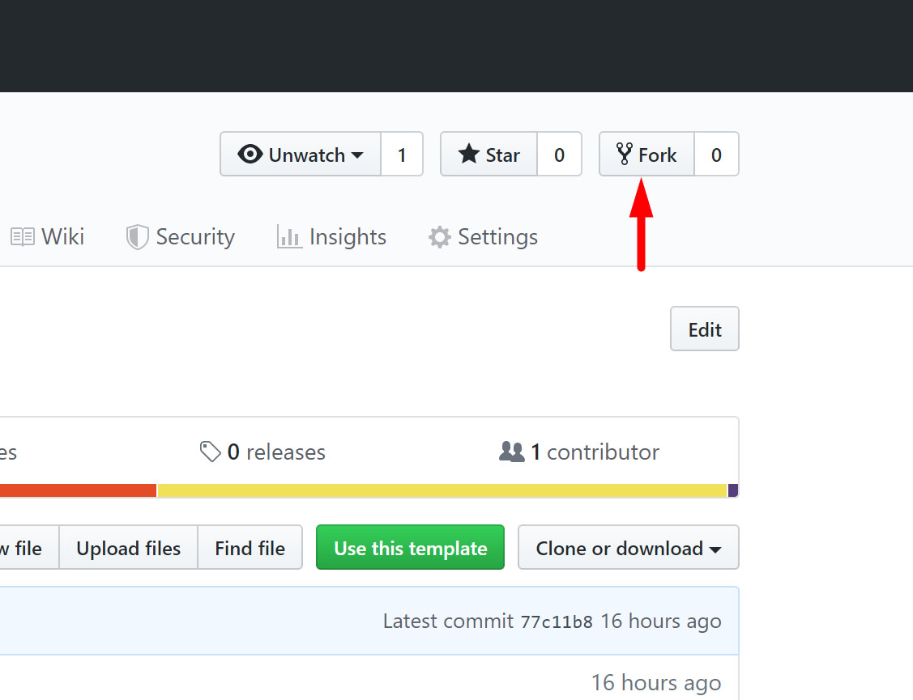
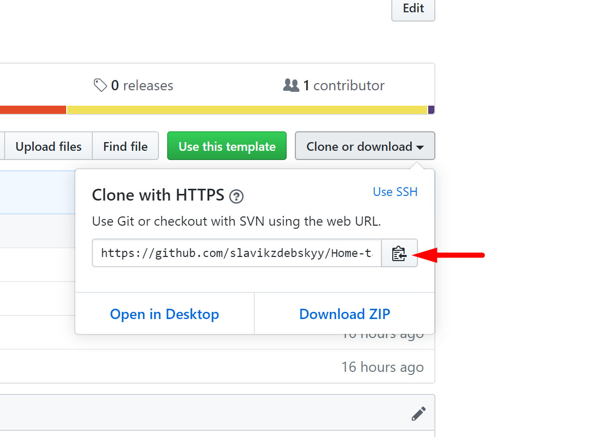
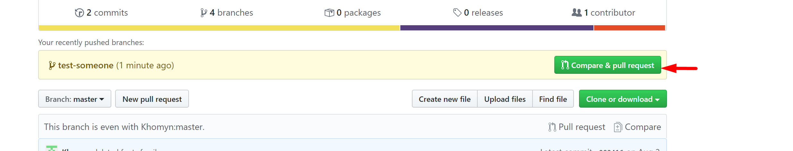
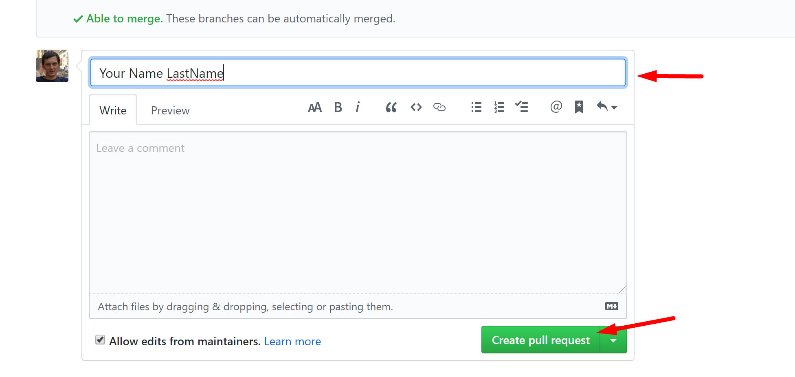

## Home task for lessons 4-5


1. Fork the project:



2. Clone project:



3. Go to the projects directory:

```
cd Home-task-4-5
```

4. Create a branch with the name of your last name:
```
git checkout -b yourLastName
```

5. Do home tasks:


6. Do commit: 
```
git add .
git commit -m"my comment"
```

7. Push your branch:
```
git push --set-upstream origin yourLastName
```

8. Create Pull Request
  *  Go to your project's repository on GitHub

  * Click button **_Compare & pull request_**
  

  * Enter PR name & click **_Create pull request_**
    </br>(_name_ should be your name & lastName)
  


## Good luck !


